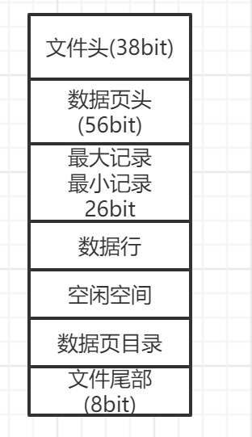
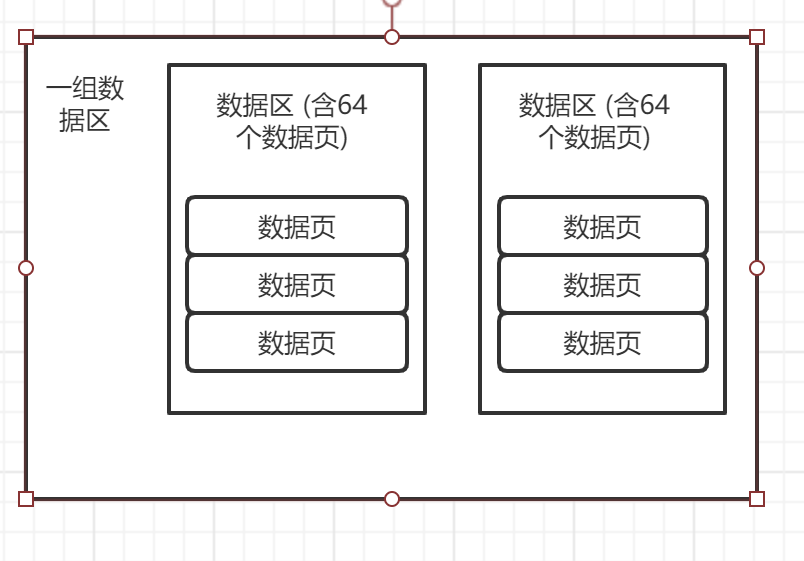
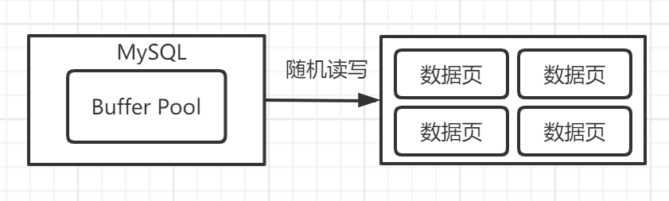
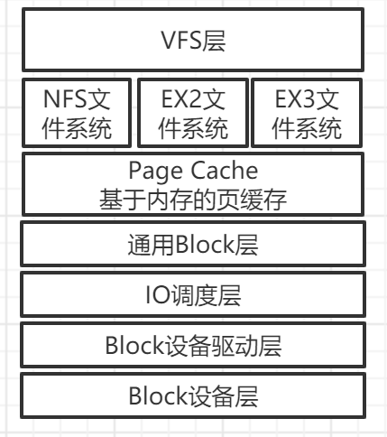
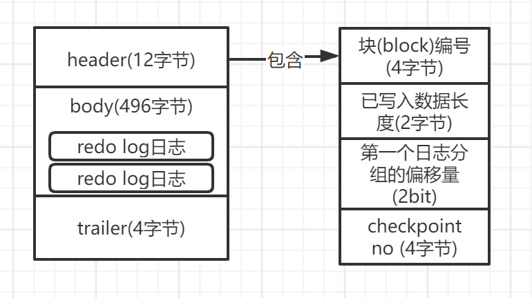
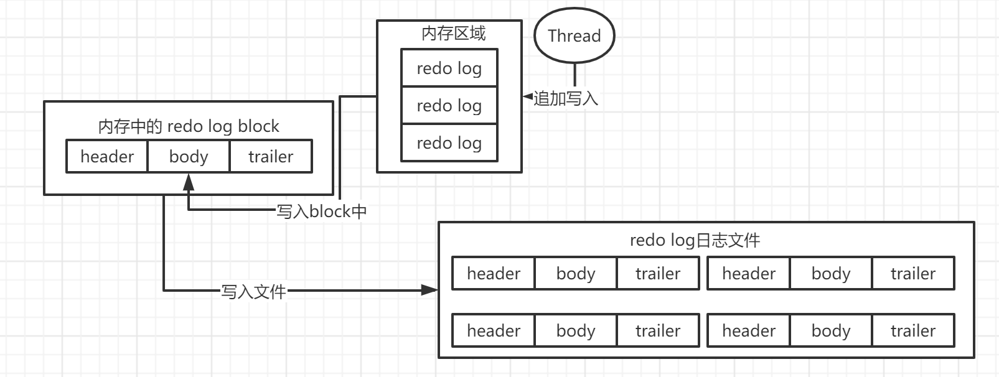

---
MySQL物理数据模型
---
1. ## 概述

   1. #### 为什么不直接更新磁盘上的文件？

      - 更新磁盘数据为随机读写
      - 必然导致性能极差
      - 更新内存和顺序写redo日志性能都是极高的

   2. #### 为什么要引入数据页的概念？

      - 解决每次加载只加载一条数据，会导致效率低下的问题
      - 加载的时候都是加载一页甚至多页 --> 数据页概念
      - 如果新id=1时，加载了其一页甚至多页数据，可能加载id=2,3等。当更新id=2的时候，就无需再去磁盘加载，可以直接更改内存数据，且刷盘也只用刷一次。

   3. #### 一行数据在MySQL中是如何存储的？

      即除每一个字段的值外，还包括一些额外信息，用来描述这一行的数据

      变长字段的长度列表 | null值列表 | 数据头 | column-1 | column-2 | 隐藏字段

2. ## 数据行存储

   1. #### 字段是如何存储的？

      例如        varchar(10)    char(1)  char(1)

      第一行		hello 			a			b

      第二行		hi 				aa			bba

      - 最终数据落地存储为:  helloabhiaabba
      - 行与行之间挨着，放在一个文件里进行存储
      
   2. #### 变长字段(varchar)是如何存储的?

      - 保存变长字段时，会带上他的变长字段长度列表

      - 如具体为5，转为16禁止则为0x05，那么实际存储为：

        0x05     null值列表     数据头   helloab 0x02  null值列表 hiaabba 

   3. #### 变长字段是如何读取的?(如上面这串字符串)

      - 首先会知道表里字段的数据类型
      - 如果是变长字段，第一行的变长列表会有该字段的值
      - 按字符串进行截取，即可获取这个字段的值

   4. #### 如果有多个变长字段，如何进行读取和存储？

      ​	如	varchar(10)    varchar(20) varchar(5)  helloab

      - 此时必须在开头变长字段长度列表中存储几个变长字段的长度

      - 变长字段长度为逆存储的,即顺序是  varchar(5) varchar(20) varchar(10)

        如  0x05 0x20 0x10  null值列表 helloab

   5. #### null值如何进行存储?

      - 有一个null值列表，占1 bit

      - 如果按照null字符串存储，则很浪费空间

      - 如果bit位是0，说明不是null，如果是1则代表为null

      - null值列表也是按照逆序排列的，且占位为8 bit的倍数，不够则高位补0

        如有一张表

        | name varchar(10) | address varchar(20) | gender char(1) | job varchar(30) | school varchar(50) |
        | ---------------- | ------------------- | -------------- | --------------- | ------------------ |
        | zhangsan         | null                | 1              | null            | Changsha           |

        则存储应该为: 

        ​		0x09 0x04  0000 1010 zhangsan1Changsha    0101则代表null值列表,高位3个0则是高位补0

   6. #### 数据头存储

      1. 占40 bit，来描述这行数据

      2. 1-2位是保留位，暂时没有任何意义

      3. 3位是delete_mask，标记这行数据是否被删除了

      4. 4位是 min_rec_mask 

      5. 5-8位供4位是 n_owned

      6. 9-21位共13位是heap_no，即当前数据在记录堆里的位置

      7. 22-24位共3位，record_type 档表这行数据的数据类型  

         - 0-普通类型 

         - 1-B+树非叶子节点 

         - 2-最小值数据 

         - 3-最大值数据

      8. 25-40位共16位指向它下一条数据的指针

   7. #### 隐藏字段 （会在它真是数据部分，假如一些隐藏字段）

      1. DB_ROW_ID字段： 行的唯一标识，数据库内部生成的标识，不是主键。ID字段，如果没有指定主键和unique_key唯一索引的时候，内部自动加入一个ROW_ID为主键

      2. DB_TRX_ID : 跟实物相关，是哪个事务更新的数据

      3. DB_ROLL_DTR： 回滚指针，用来执行事务回滚

         所以实际存储为

         0x09 0x04 (可变长度列表 16进制数字)  00001010 (null值列表 1个bit位)  0000....329....10078E (对象头 16进制)  0x09 0x08 0x07 (内容)  0032D... (DB_ROW_ID)  EA....10E(DB_TRX_ID)  61..62 (DB_ROL_DTR)

   8. #### 行溢出是什么？一个数据行大小为16kb，如果数据行的大小超过16kb会怎样？

      1. 第一页的数据页中，仅包含他一部分数据，同时也包含一个20字节的指针，指向了第二个数据页
   2. 那些数据页就叫页溢出，包括如Text、Blob等，都可以导致页溢出，即一行数据存储在多个数据页中
   
3. ### 数据页

   1. #### 数据页包含了什么？
      
    
      - 文件头
      - 数据页头
      - 最小记录
      - 最大记录
      - 多个数据行空闲空间
      - 数据页目录
      - 文件尾部

   2. #### 缓存页与数据页

      - 缓存页与数据页是一一对应，数据页加载后即是缓存页
      - 往缓存页插入一条数据，实际上是在数据行的那块区域插入一行数据，空闲空间就会相应的减少
      - 可不停的讲数据插入到缓存页中，直到他空间消耗尽了，即页满了，空闲页也没空间了

4. ### 表空间
   
    
   1. #### 什么是表空间？
      
      1. 表空间在磁盘上都会对应相应的文件，为 表名.ibd 的文件
      2. 表空间即对应磁盘上的一些数据文件，有的有多个文件，有的只有一个文件
      3. 一个表空间中含有多个数据页
      4. 由于表空间太多，不好管理，故引入了表区域的概念
   2. #### 什么是表区域？extent
      
      - 一个表区域（extent）对应64个数据页，每个数据页16k，故每个表区域的大小为1M
      - 256个数据区划分一个数据组
      - 对表空间而言，第一个组的第一个区的前三个数据页的数据是固定的，存放了一些描述性数据
      - FSP_HDR这个页，存放的是这一组数据页的所有insert buffer信息
      - INODE数据页，存放了特殊信息
      - XDES数据页，存放了配置的信息
      - 表空间的其他组里的第一个数据区的前两个数据页，也是存放了特殊的信息

5. ### MySQL和操作系统底层的交互原理

   1. #### 存在哪些读写盘的请求?

    
      1. redo log、undo log 、 binlog这种日志的顺序读写
      2. 从表空间找到找到数据页的随机读写，如表的缓存页刷盘、从磁盘文件随机读取数据页，由于数据页可能在任意位置，故此时读写磁盘为随机读写

   2. #### 哪些情况对随机读写有影响？

      1. IOPS： 每秒执行多少个随机读
      2. 相应延迟： 读取到数据返回的时间
      3. 推荐： 一般核心系统数据库都建议直接使用SSD，可大幅度提升QPS和性能。

   3. #### 哪些情况对顺序读写有影响?

      1. 一般情况下，顺序写有很好的性能，甚至与内存读写的性能差距不大
      2. 数据库里，其实也用了系统缓存（OS Cache）。顺序写一般都先写入OS Cache，再刷入缓存

   4. #### 操作系统文件系统指标？

      - 对数据库系统而言，最重要指标为每秒多少数据量的吞吐
      - 每一次请求都伴随随机读取数据页到缓存的操作
      - 涉及了一系列的日志写入

6. ### Linux文件系统

    
   1. #### 分层：

      - VFS层：
      - 文件系统层：例如有NFS、EX2、EX3等文件系统
      - Page Cache 基于内存的页操作系统缓存
      - 通用Block层
      - IO调度层
      - Block设备驱动层
      - Block设备层

   2. #### 顺序：

      1. 当MySQL发起一次数据页的随机读写，或者是一次redo log日志文件的顺序读写时，实际把IO请求交给了linux的VFS层
      2. VFS层作用为根据是哪个目录，将IO请求交给具体的文件系统
      3. Page Cache基于内存找数据是否存在，没有则往下一层，即Block层进行转发
      4. 通用Block层将IO请求转为Block IO请求之后，会将Block IO请求交给IO调度层，默认用CFQ公平调度算法
      5. CFQ公平调度算法： 
         - 如先执行一操作 ： update * from user where name like '%a%'
         - 再执行一操作 : update name = newname where id = 1
         - 此时先执行一，但是因为一执行很耗时，导致二这个很快的执行操作无法正常执行，这既是公平调度算法
         - 故建议MySQL生产环境改为deadlink IO调度算法
      6. deadline IO调度算法： 任何一个IO操作都不能一直不停的等待，在指定时间范围内必须去执行请求
      7. IO调度层完成后会生成调度计划，就会决定哪个IO请求先执行，此时可执行请求就会交给Block设备驱动层
      8. 经过驱动层把IO请求发送给真正的存储硬件中，即Block设备层

   3. #### RAID存储架构

      1. ##### RAID是什么？
         
         1. 磁盘冗余阵列，用于管理机器里的多块磁盘的一种磁盘阵列技术
         2. 可横向扩展磁盘的容量
         3. 可做数据冗余机制
      2. ##### RAID存储架构的电池充放电原理
         
         1. 服务器使用多块磁盘组成的RAID阵列时，一般会有一个RAID卡
         2. RAID卡是自带缓存的，缓存是一种类似的SDRAM，基于内存进行操作
         3. write back模式： 所有写入数据会先缓存在RAID卡的缓存里，然后返回成功。后续再由RAID卡慢慢由缓存刷入到磁盘之中，可大幅度提升写入的性能。
         4. 由于写入的地方为缓存，所以怕断电之后换粗怒数据丢失，故每块RAID卡都必须配备锂电池，以便于断电后的数据刷盘
         5. 但锂电池会存在性能衰减问题，所以一般来说，锂电池需配置定时充放电功能
         6. 在充放电时，缓存级别会从write back变更为write throungh模式
         7. write throungh模式: 写入的时候直接写入磁盘，此时写入性能极差
      3. ##### RAID的模式：
      
         1. RAID1模式：即两块磁盘互为镜像模式
      2. RAID10模式： 即RAID0+RAID1组合，如有6块1T磁盘，组成了容量3T且互为镜像的RAID磁盘列阵
   
4. #### 电池充放电导致的数据库抖动：
   
   1. ##### 引发问题：
   
      当RAID阵列中的锂电池进行充放电，导致数据写入直接写磁盘，不走缓存。使得充放电这段时间性能抖动厉害，性能比使用缓存的时候差几倍。
   
      2. ##### 解决方案：
   
      1. 给RAID卡把锂电池换成电容。电容是不用频繁的充放电，不会导致充放电的性能抖动，并且支持透明充放电。不会导致充放电的时候缓存失效。但是更换电容麻烦，所以此方案基本不用
         2. 手动充放电： 比较常用，写一个脚本，在晚上、凌晨的业务低峰时期，脚本手动触发电容充放电
         3. 充放电时，不要关闭write block模式
   
8. redo Log日志

   1. redo log日志格式

      大致表达了如下的意思: 对表空间xx（表空间名）中的数据页yy（数据页页号）中的偏移量zzz的地方更新了数据，更新的值为aa

   2. 写redo log日志和刷盘缓存页的差距?

      - 缓存页的刷页是以页为单位，大小为15K，可能只修改了部分数据，但是也要整页的刷。所以相对于redo log日志这种比较耗时
      - 缓存页读写为随机磁盘IO读写，性能较差
      - redo log日志是以顺序追加在尾部，速度快，性能好
      - redo log日志写入的内容较少，仅包括表空间、数据页号，磁盘文件偏移量、更新后的值等

   3. redo log日志类型

      - redo log写入的时候是有数据类型的，根据数据类型不同会生成不同的redo log日志文件

      - Byte类型： MLOG_1BYTE代表修改了1字节的值，MLOG_2BYTE代表修改了两byte,以此类推

      - String类型: MLOG_WRITE_STRING 代表修改了一大串的字符串值

      - 所以，redo log日志的结构为：

        ​	日志类型(如 MLOG_2BYTE) 、 表空间ID 、 数据页号 、 页的偏移量 、 修改的数据长度（MLOG_WRITE_STRING)时使用 ， 修改后的值

   4. redo log block

    
      - 用于存放多个单行的redo log日志
      - 一个redo log block日志是512K ， 包含三个部分 header （12字节）、 body （496字节）和trailer （4字节）
      - header包含：
        - 块编号（4字节）： block no 是block的唯一标识
        - data length（2字节） 记录了这个block中写入了多少字节的数据
        - first record group （2字节） 通常一个事务可以含有多个redo log日志，一个事务所含的redo log日志是一个group组，redo log日志用此来记录redo log日志属于哪个组，即记录第一个redo log的位置
        - check point no（4字节）
      - body中包含了一条条的redo log日志

   5. redo log日志写入磁盘顺序

    
      - 先在内存中生成一系列的redo log日志，然后拼接好
      - 在内存中生成一个redo log block区域，然后将拼接好的redo log日志写入block的body之中
      - 内存中的redo log block刷入到磁盘中。（可一个个字节的进行追加）

   6. redo log block是如何经过内存缓存写入到磁盘的？

      - redo log buffer： 用来缓存redo log日志的，为MySQL启动的时候，向系统申请的一段连续内存空间，然后将这段连续内存空间划分为一系列的redo log block buffer空间
      - 通过innodb_log_buffer_size可指定redo log buffer的大小，默认是16M 。 （原则上16M是足够了）
      - 当redo log block写满之后，会将数据刷入磁盘
      - 一个事务的一组redo log会先缓存到一块内存区域，然后再一次性写入redo log buffer之中
      - 可以配置当事务提交就将对应的redo log 日志立刻刷入磁盘之中
      
   7. redo log block是哪些时间点进行刷盘的?
   
      - 如果写入redo log buffer的日志占了其一半（默认是8M），此时会进行刷盘
      - 一个事务提交的时候，会把log在block进行刷盘
      - 后台线程定时刷盘，每隔一段时间（1秒）即把buffer中的block刷入磁盘
      - MySQL关闭的时候进行刷盘
   
   8. 当redo log文件越写越大怎么办？
   
      - 相关命令：
        - 查看写的哪个路径下： variables like 'datadir'
        - 修改目录： innodb_log_group_home_dir
        - 设置文件大小：innodb_log_file_size ，默认是48M
        - 设置文件数量： innodb_log_files_in_group ，默认是2个文件
      - 写满一个文件之后，会覆盖性的写第二个文件
      - 开始覆盖写第二个文件的时候，会强制将第二个文件的缓存页刷入磁盘
   
9. undo log日志

   1. 是什么?记录了什么?

      - 即回滚日志
      - 记录了你对数据库的操作时候的SQL语句
      - 如一条insert语句，则记录了日志里的delete，反之则为insert
      - update则将数据update为原数据

   2. 长什么样子?

    
      1. 记录了哪些东西?
         - 这条undo log日志的开始位置
         - 主键的各列场地和值(主键每个列的长度，无则是默认的ROW_ID)
         - 表的主键-id
         - undo log日志编号：每个undo log日志都有自己的编号，同一个事务第一个日志为0，然后递增
         - undo log日志类型：如TRX_UNDO_INSERT_REC代表插入
      2. 要回滚时，从undo log获取回滚日志，然后根据主键删除
