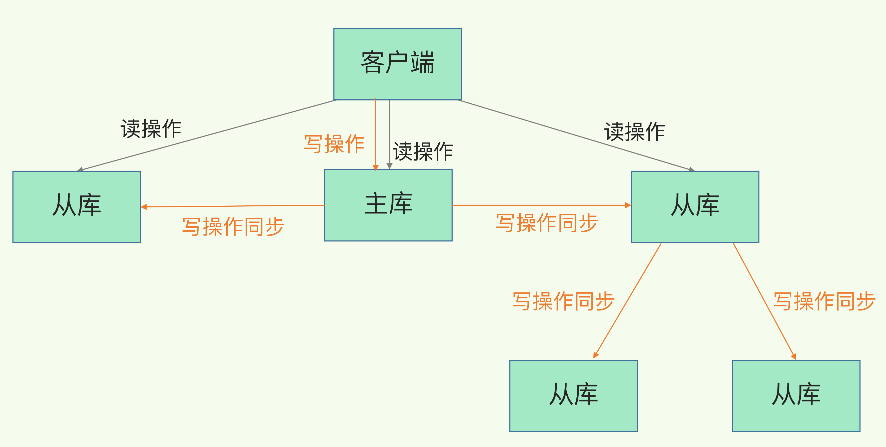

# 一致性和高可用

## 主从库的数据一致性

1. ### 为什么要有数据一致性？

   缓解写请求压力，也可当redis的数据备份

2. ### 解决了什么问题?

   1. 服务尽量少中断: 增加副本冗余的数量
   2. 读写分离

3. ### 主从库第一次数据同步执行了哪些过程?

   

   1. 第一阶段:
      1. 从库与主库建立连接，并告知主库即将进行数据同步
      2. 从库发送给主库psync命令，包含runID（此时还未获取到主库的runID）和复制的offset进度（默认是-1）
         - runID为每个redis启动的时候，随机生成的ID，第一次为？号
         - offset表示复制进度，第一次为-1
   2. 主库将所有数据转储为RDB文件，发送给从库，从库在本地进行加载
   3. 主库把第二阶段（在生成和传输RDB文件）期间产生的日志写入到内存，再发送给从库

4. ### 主-从-从模式

   

   1. 解决问题： 主库复制的时候传输开销
   2. 将生成RDB文件的开销和传入RDB文件的压力分散到从库中
   3. 部署的时候，可手动选择一个从库，用于级联其他从库，然后自动选择一些从库（如1/3的从库)在这些从库上执行命令，让他们与所选从库建立主从关系，replicaof所选从库即 ip 6379
   4. 后续会维护一网络连接，长连接进行数据同步

5. ### 主从库之间的网络连接

   1. 存在的风险：
      1. 网络断连
      2. 网络阻塞
   2. 网络断连后会执行哪些操作?
      1. 在redis版本2.8之前，如果发生断连，主库会和从库发生一次全量复制
      2. 在redis版本2.8之后，主库会采用增量复制的方式继续同步数据
         - 增量复制时，有一个repl_backlog_buffer缓存区
         - 主从库的网络连接断开之后，主库会把断开连接期间的写命令，写入到replication buffer这个区域
         - 同时写写入到repl_backlog_buffer缓冲区
         - repl_backlog_buffer是一个环形缓冲区，主库会读取自己写入的位置，从库会读取自己读取的位置。分别是master_repl_offset和slave_repl_offset
         - 主库仅需讲两个offset之间的命令同步给从库即可
      3. replication_backlog_buffer是一个环形缓冲区，缓冲区满后会继续写入数据，会覆盖之前的写入命令
      4. repl_backlog_size大小： 公式为 大小=主库写入速度*操作数据的大小 - 朱从库之间网络传输命令速度*操作大小，不过一般会取此值的两倍
   
6. ## 总结：

   1. 同步原理：
      1. 全量复制： 耗时。故一个redis实例不应太大，几个G的数据即可。也可用主-从-从架构
      2. 基于长连接的命令传输： 正常连接的复制。网络断连的时候，使用增量复制
      3. 增量复制：需调整环形缓冲区repl_backlog_size大小，如覆盖了则会进行全量复制
   2. 为什么用RDB日志，而不是用AOF日志？
      1. RDB是二进制文件日志，文件较小，传输速度快，恢复速度也快
      2. AOF日志会影响redis的吞吐量
   3. 应该是主库有从库存在，都会有一个repl_backlog_buffer缓冲区，从库断连后发送psync $mastered_runid $offset进行数据同步
   4. replication buffer : redis与从库或客户端通信，都会分配一个client buffer，redis先把数据写入到这块buffer中，然后把offset中的数据发送到client socket中，通过网络发送出去，主从同步的通信缓冲区通常称为 replication buffer
   5. client-output-buffer设置上述的大小，如主从复制异常慢会导致此块内存空间过大，而发生OOM

## 高可用

1. ### 高可用涉及到三个问题:

   1. 主库是否真的宕机了
   2. 该选择哪个从库来接替主库
   3. 怎么把新主库相关信息通知给从库和客户端

2. 哨兵机制的基本流程

   1. 哨兵的任务:
      - 监控
      - 选举
      - 通知
   2. 监控
      - 运行的时候,发送ping命令
      - 如果redis实例未在规定时间内回复，即会被判断为主观下线
      - 主库如若被标记为客观下线，则会进行选举
   3. 选举：
      - 通过一定规则将从库选举为主库
   4. 通知：
      - 把新主库的信息发送给所有从库，让他们执行replica of命令连接新的主库
      - 把新主库信息发送给客户端

3. 主观下线和客观下线

   1. 主观下线：

      - 即哨兵用ping命令检查自己与各个库的状态
      - 如果超时未返回信息，则标记这个实例为主观下线
      - 检测的为主库的时候，要防止误判

   2. 客观下线

      - 需要大多数实例（哨兵）认为主库下线了，即变成客观下线
      - 需要（n/2 +1）个哨兵判断主库下线即会成为客观下线
      - 主库客观下线后进行主从切换

   3. ### 如何进行新主库的选举？ 筛选如何打分？

   4. 筛选：

      - 检查当前实例和之前的网络状态，如果累计断连时间超过断连的阈值，则不再考虑成为主库

   5. 打分

      - 首先选择从库的优先级。可手动设置优先级，可以根据机器配置设置不同的优先级。如若优先级一样，则往下走
      - 判断从库的复制进度offset。即repl_backlog_buffer的slave_offset和slave_offset最接近主库master_offset的值，越接近优先级越高，如果都一样则往下走
      - 从库的ID号

4. ### 基于pub/sub哨兵机制的集群组成

   

   1. 哨兵实例会在主库上发布自己的消息，和订阅其他库的同步消息。 ____sentinel____:hello 即不同哨兵之间通信的频道

   2. 哨兵会将自己的ip:port通过上述频道发送给其他的哨兵实例

   3. 哨兵之间通过收到的ip:port建立起网络连接

   4. 哨兵向主库发送info命令，获取从库的连接信息，然后与从库进行网络连接

      

5. ### 基于pub/sub机制的客户端事件通知

   1. 解决问题：

      客户端获取哨兵集群在监控、选主、切换这个过程发生的事件和进度

   2. 哨兵也是一个运行在特定环境中的redis实例，只不过它只负责做监控、选主和通知的任务

      

   3. 有了上述进度，客户端即可了解数据库的状态，和事件执行的进度

6. ### 由哪个哨兵进行主从切换？

   1. 和判断redis实例下线类似，铜通过投票机制判断进行选举
   2. 任何一实例判断主库主观下线后，会发送给其他实例一个 is_master_down_by_addr 命令，其他哨兵实例根据自己与主库的链接状态，做出Y（同意） 和N（不同意）的相应
   3. 获得所需赞成票后（n/2+1)，发起投票的实例会标记其为客观下线
   4. leader选举：上述哨兵会通过命令，通知其他哨兵希望自己来执行主从切换，需要满足一下两条件
      - 拿到半数以上的赞成票
      - 拿到赞成票数还需要大于等于哨兵文件中quorum值

## 切片集群

1. ### 大数据量如何存储？例如有一个25G实例的数据

   1. 选32G云主机，持久化选择RDB

      

      1. 存在问题：
         - 有时，响应非常慢
         - 使用info命令查看latest_fork_usec指标值（最近一次fork子进程耗时）特别高
         - 是fork子进程的时候导致过慢。RDB进行持久化的时候，会将内存进行拷贝，数据量越大越耗时
      2. 切片集群方案
         - 指启动多个redis实例组成一个集群，按一定规则，把收到的数据划分成多份，每一份用一个redis实例来保存
      3. 上述代表了横向扩展和纵向扩展
         1. 纵向扩展
            - 升级单个redis实例的资源配置，包含增加内存容量、增加磁盘容量、使用更高配的cpu
            - 优点：
              - 简单、直接
            - 缺点
              - 使用RDB进行持久化的时候，需要的内存会增加，fork子进程时阻塞时间会变长
              - 会受到硬件和成本的限制
         2. 横向扩展
            - 增加redis实例组成切片集群
            - 优点：
              - 不用担心单实例硬件和成本的限制
            - 缺点
              - 如何进行分片的部署
              - 数据在哪个实例上？怎么让客户端知道

   2. ### 数据切片与实例对应关系（基于redis cluster）

      1. hash槽即hash slot，会分成16384个分片，每个key都对应一个分片
      2. 如何进行key的放置
         - 根据key，按CRC16算法计算一个16bit的值
         - 用求出的16bit的值对16384取膜
      3. 放置key到对应的槽
         - 使用cluster create命令创建切片集群，有N个实例，即每个实例都有 （16384/n）个槽
         - cluster meet 命令手动建立实例间连接
         - cluster addslot命令，指定每一个实例的槽个数

   3. ### 客户端如何定位？

      1. Redis实例会把自己hash槽信息发送给其他实例
      2. 客户端接收到信息缓存到本地，会先计算键所对应的槽信息
      3. 槽会变化：
         - 实例有增删，Redis会重新分配槽
         - 为了负载均衡，需要将槽再分配一遍
      4. 重定向机制
         - MOVED命令，即客户端给实例发送写请求，实际上该实例并无这个槽的信息，会返回新实例的信息
         - 通过ACK报错信息返回所在实例地址

