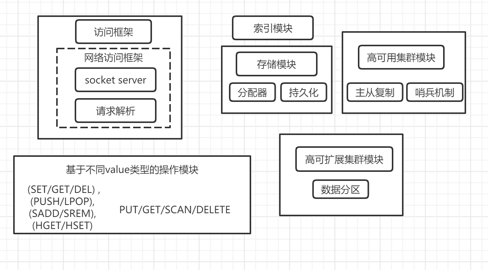
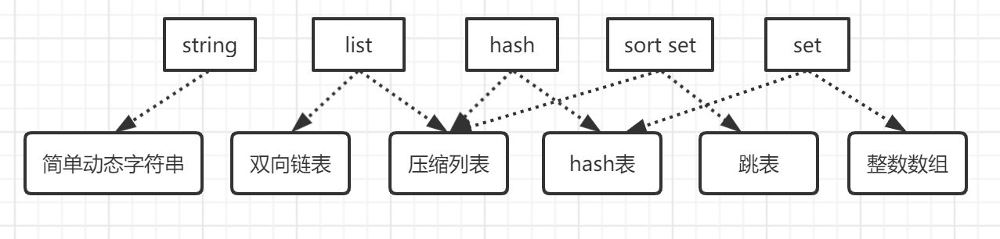
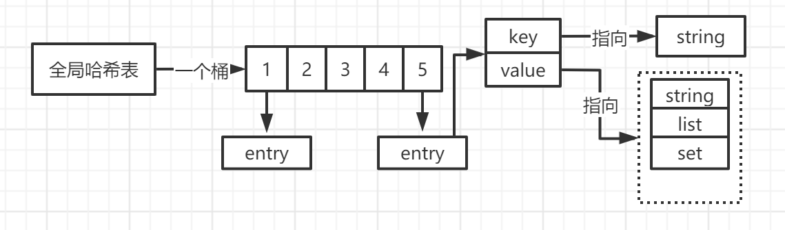
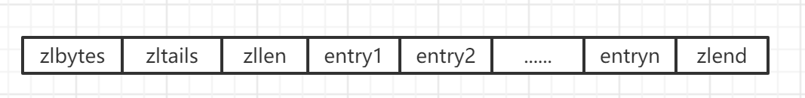
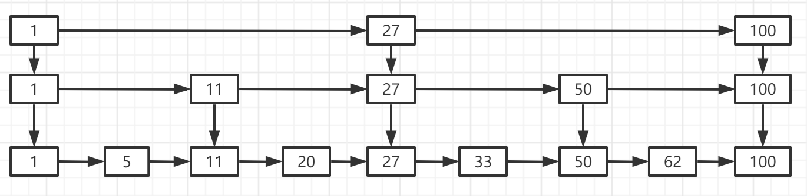

# 数据库设计

## 概述

1. ### 两种访问模式

   1. 提供函数库调用的方式供外部客户端使用。如提供libsimplekv.so，以动态链接库的形式链接到我们程序中，提供存储
   2. 通过网络框架的socket通信对外提供操作

2. ### 网络框架提供键值存储服务存在的问题

   1. 网络处理、请求解析、数据存储是单线程的还是多线程的？ 即网络IO应该如何进行设计
   2. 单线程如何避免阻塞
   3. 多线程的资源共享如何实现？怎么避免线程竞争？

3. ### 如何定位键值对对应的内存位置？

   1. 索引： 让键值数据库根据key查找对应的value的位置

   2. 常见的索引： hash表索引、B+树索引、字典树等

   3. 常见库及其对应的索引类型：

      Redis、memcache使用的为内存存储，由于内存有高性能的随机访问特性，而且能有hash表做O（1）的时间复杂度 ，所以一般为hash表做索引

4. ### 不同操作之间的具体逻辑差异

   1. GET/SCAN： 通过hash表根据key位置返回value对应的值即可
   2. PUT : 需要对内存分配空间
   3. DELETE: 删除并释放内存空间，由分配器完成

5. ### 存储模块

   1. 采用常见内存分配器glibc框架的mailoc和free
   2. 并不用开发人员特别考虑内存空间管理问题
   3. glibc处理随机大小内存块表现并不好，一旦key规模过大，即可造成碎片化问题
   4. 可以将key、value直接写入磁盘，但是会影响存储性能
   5. 周期性地将数据进行持久化

## Redis设计

1. ### Redis架构设计

   

   1. 通过网络框架访问，不是直接动态库
   2. 丰富的value模型
   3. 持久化模块。AOF和RDB
   4. 支持高可靠集群和高可扩展集群

2. ### Redis有哪些数据结构?

   

3. ### 键和值之间用什么结构组织?

   

   1. Redis使用了一个hash表保存了所有的键值对
   2. 一个hash表即一个数组，数组每一个元素即hash桶。每个桶中保存了键值对
   3. 值为保存指向具体值的指针
   4. 查询的时候，拥有o（1）的时间复杂度
   5. 潜在风险： hash冲突和rehash可能带来操作阻塞
   6. 解决方案： 链式hash，即同一个hash桶中的多个元素之间用一个链表来进行保存，他们之间依次用指针相互指向

4. ### Rehash过程

   1. 即当链表容量达到一定阈值的时候，进行扩容

   2. 为了使用rehash操作更高效，默认使用了两个hash桶进行操作

   3. 一开始使用了hash表1，此时hash表2未被使用，且未分配空间。随着key的增加，要进行rehash后，则需要进行以下操作：

      - 给hash表2更大的空间，如为hash表1的两倍空间
      - 把hash表1的空间中的数据重新拷贝到hash表2中
      - 释放hash表1的空间
      - 但是第2步涉及到大量的数据拷贝，一次性迁移完成会造成线程长时间阻塞

   4. 渐进式hash：

      即在数据拷贝的时候，redis任然以hash表1为存储与客户端进行正常交互。每处理一个请求的时候，从hash表1中的第一个索引位置开始，顺带将这个位置上的entries拷贝到hash表2中

5. ### Redis各个数据类型的操作效率

   1. string： o(1)的时间复杂度，在hash桶找到对应的key即可

   2. 集合（list）： 

      - 找到hash桶的位置
      - 集合访问效率与具体的数据结构相关

   3. hash表（set）： o(1)的时间复杂度

   4. 整数数组、双向链表： o(n)的时间复杂度

   5. 压缩列表：根据元素位置不同，有不同的复杂度。

      - 查找第一个元素和最后一个元素，通过表头即可具体定位到数据，拥有o（1）的时间复杂度

      - 其他元素需要逐个元素进行遍历，复杂度为o（n）  n即链表长度

        

      - 相当于一个数组，表头有三个字段： zlbytes、zltail和zllen ， 分别表示压缩列表长度、压缩列表尾部的偏移量和压缩列表中entry的个数。尾部还有一个zlend表示压缩列表结束

   6. 跳表： 跳表即在有序列表的基础上，增加了多级索引，实现快速定位，类似MySQL的B+树索引，所以时间复杂度是o(logN)

      

6. ### 操作复杂度口诀

   1. 单元素操作是基础：

      即每一种集合类型对单个数据的CURD操作，如hash的HGET、HSET和HDEL，Set的SADD、SREM、SRANDEMBER等。这些由数据结构决定的数据类型，对多个元素进行操作即o(n)

   2. 范围操作非常耗时:

      指集合类型中的遍历操作，然后返回一批数据。这个操作非常耗时，且会阻塞线程。不过有scan进行替代

   3. 统计操作通常高效

      指集合类型对所有集合的统计操作，如统计个数。时间复杂度通常为o（1）

   4. 例外操作仅有几个：

      即某些特殊条件的特殊记录，如压缩列表和双向链表都会记录表头、表尾的偏移量，时间复杂度是o（1）
