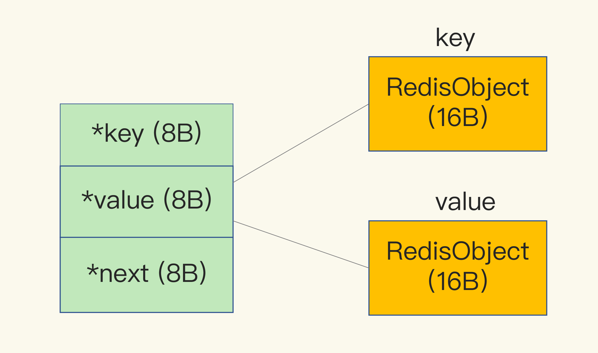

# 数据结构与算法

## 数据结构

1. ### string数据类型的value

   1. 除了记录实际数据，还需额外内存记录数据长度、空间使用长度等

   2. 当你保存了64位有符号整数时，string类型会把它保存为一个8字节的long类型的数组，也成为int编码方式

   3. 保存的数据有字符时，使用SDS（simple dynamic string）结构来保存数据，如下图所示

      

      - len(4B) 表示buf的实际使用长度
      - alloc(4B) 表示buf的实际分配长度
      - buf("Redis\0") 表示实际的数据，末尾有一个\0代表数据结束

   4. 除了SDS开销，还有一个来自于RedisObject结构的开销，因为Redis的数据类型很多，而且不同的数据类型有些相同元素数据要记录。（例如最后一次被访问时间、被索引次数等）

      

      1. RedisObject包含了8个字节的元数据，和一个8字节的指针，元数据为int编码

      2. 当保存为long类型的数据时，RedisObject中的指针就是直接赋值为整数数据，不需要额外开销

      3. 当保存的为字符串类型，且字符串长度小于44字节的时候，元数据、指针和SDS结构是一块连续的内存空间，通过embset编码

      4. 当保存的为字符串类型，且大于44字节的时候，采用raw编码

         

   5. hash表的entry结构

      

      1. dictEntry结构
      2. 这里还剩32bi ， 但是key、value和next仅包含24bi，还剩下8bi数据存放在哪？
      3. 原因： jemalloc内存分配器在申请内存的时候，会根据申请的字节N，找一个比N大，但是接近N的32位整数。（如24位->则选择32位)，这样可减少内存的频繁分配

2. 压缩列表： ziplist

   

   1. 每个元素包含以下几个部分：
      - prev_len： 表示当前一个entry的长度，有两种情况
        - 1字节： 当前entry长度小于254字节，即用一个字节表示
        - 5字节： 当前entry长度大于等于255字节，即用5字节来表示长度
      - len表示： 表示自身长度，4字节
      - encoding： 表示编码方式，1字节
      - key（content）： 实际的数据存储
   2. 会挨个放在内存之中，不用指针指向
   3. 故采用基于hash类型的二级编码
   
3. hash类型什么时候使用hash表？什么时候使用压缩列表？

   1. hash-max-ziplist-entries： 表示用压缩列表表示最大数量
   2. hash-max-ziplist-value： 表示用压缩列表保存时，单个元素的最大长度
   3. hash表是没有压缩列表节省空间的

## 数据统计

1. ### 有哪些统计方法?

   - 聚合统计
   - 排序统计
   - 二值状态统计
   - 基于统计

2. ### 聚合统计

   1. 统计多个集合元素的聚合结果,包含交集统计、差集统计、并集统计等
      - 交集统计： SUNIONSTORE
      - 差集统计：SDIFFSTORE
      - 并集统计： SINTERSTORE
   2. 计算复杂度高，会导致Redis阻塞，故可用一个从库来进行统计计算
   
3. ### 排序统计

   1. 要求能对集合保序，List和SortedSet可保证顺序
   2. List类型根据插入时间排序，新插入的为头部信息，当分页查询的时候，插入一条数据易发生数据错误，lange命令
   3. SortedSet则没有，更新频繁和分页的时候用此数据类型

4. ### 二值状态统计：

   即集合元素只有0和1两种，如是否签到

   BitMap： 本身是用string类型作为底层数据结构和实现的一种统计二值状态的数据类型

5. ### 基数统计：如统计元素中不重复的集合个数

   1. Set集合： hash集合

   2. hyperloglog： 用于统计基数的集合类型，当集合元素非常多时，计算时消耗元素空间固定，12kb的内存可计算2^64个元素的数据

   3. RFADD命令将其进行添加

   4. 基于概率，有一定的误差，大概在0.81%

      

## GEO

1. ### 什么是LBS？

   即基于位置服务的应用

2. ### GEO的哈希编码

   1. 先对经纬度分别进行编码，再组合编码

   2. 按二分区编码方式进行编码，如经度分区为[-180,180] ，纬度范围为[-90,90]

      1. 判断是否落在左分区[-180 , 0 ] 还是落在右分区 [ 0, 180]上，左分区用一个位0，右分区用1表示
      2. 如落在左分区上，再次分区[-180 , -90] 还是 [-90 , 0] 上
      3. 当做完N次分区后，即可用一个Nbit数来表示，如10011
      4. 编码完成后进行组合，编码值偶数位是经度编码值，奇数位是纬度编码值

      

3. a